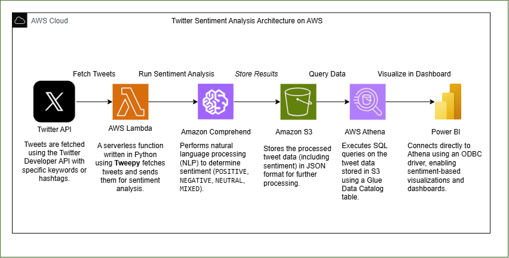

# Real-Time Twitter Sentiment Analysis using AWS

This project demonstrates a real-time data pipeline that performs sentiment analysis on tweets using AWS services. The processed data is then visualized using Power BI.

---
## 📚 Tech Stack

- AWS Lambda
- Amazon Comprehend
- Amazon S3
- AWS Athena
- Twitter API (Tweepy)
- Power BI

---

## 📌 Project Architecture



### Steps:
1. **Twitter API** – Tweets are fetched using the Twitter Developer API with specific keywords or hashtags.
2. **AWS Lambda** – A serverless function written in Python using `Tweepy` fetches tweets and sends them for sentiment analysis.
3. **Amazon Comprehend** – Performs NLP to determine sentiment (`POSITIVE`, `NEGATIVE`, `NEUTRAL`, `MIXED`).
4. **Amazon S3** – Stores the processed tweet data (including sentiment) in JSON format.
5. **AWS Athena** – Executes SQL queries on the tweet data using a Glue Data Catalog table.
6. **Power BI** – Connects to Athena using ODBC to visualize sentiment trends.

---

## ⚙️ Lambda Function

Python script to fetch tweets and analyze sentiment.

`lambda_function/lambda_function.py`

---

## 🧬 Data Model

Below is the simplified structure of the processed tweet data stored in S3 and queried via Athena:

```json
{
  "tweet_id": "1234567890",
  "username": "user123",
  "text": "This product is amazing!",
  "timestamp": "2025-04-22T10:45:00Z",
  "keyword": "product",
  "sentiment": "POSITIVE"
  }
}
```

---

## 🧾 Athena Query

```sql
-- sentiment_aggregation.sql
SELECT
  sentiment,
  COUNT(*) AS count
FROM
  tweets_data
GROUP BY
  sentiment;
```

---

## 🖼️ Screenshots

- **Lambda Logs**: `Screenshots/cloudwatch_logs.png`
- **Lambda Running**: `Screenshots/lambda_running.png`
- **S3 Output**: `Screenshots/S3_tweets.png`
---

- **Data Flow**: `Screenshots/Dataflow.png`

## 📦 Data Flow

: `Screenshots/Dataflow.png`

---

## 📊 Dashboard

Power BI connects directly to Athena using ODBC and provides real-time insights on public sentiment.
- **Power BI Dashboard**: `Screenshots/powerbi_dashboard.png`
---


## 🧑‍💻 Author

Built with ❤️ by [Your Name]
